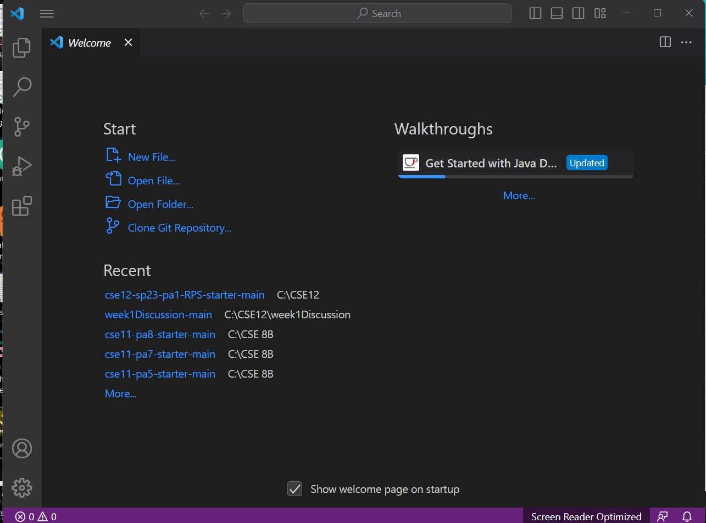
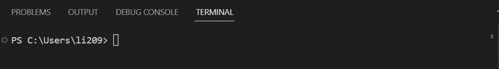
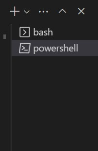
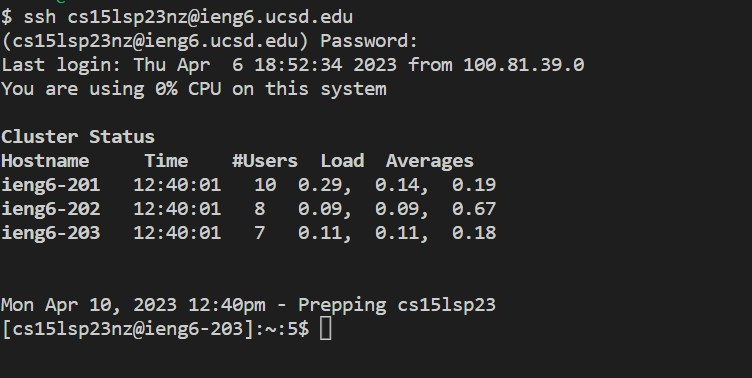
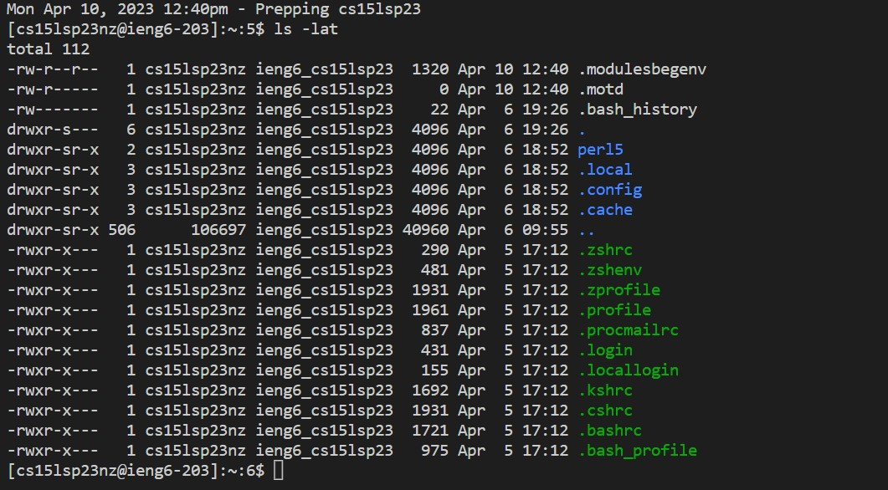
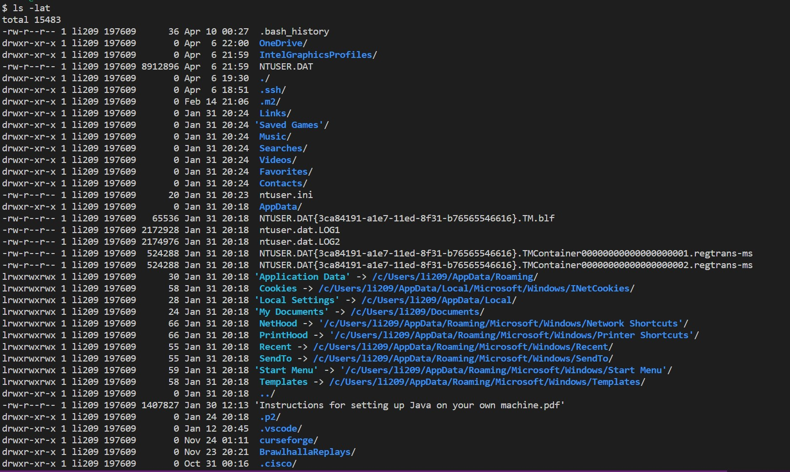

Lab Report 1
============
**Step 1:** Download the Virtual Studio Code on https://code.visualstudio.com/Download (choose the version that match your system)

**Step 2:** Windows users: install Git(https://gitforwindows.org/)

**Step 3:** Open terminal in VScode -> view -> terminal

**Step 4:** Open the command palette by pressing Ctrl + Shift + P and enter Select Default Profile (Click on Git Bash from the options)

**Step 5:** Now your terminal should have two options when pressing + icon: powershell and bash

**Step 6:** In the terminal, enter command $ ssh cs15lsp23**@ieng6.ucsd.edu (** should be replaced by your own course-specific username)

Then use your course-specific password to login (The password won't be shown on terminal when you enter)

If you are not sure about the username or password, use this link to look up your account or change password:

https://sdacs.ucsd.edu/~icc/index.php

You may receive a massage warn you about connecting once you enter the correct password - ignore the message and type yes

**Step 7:** Once connection is established, your terminal should look like this

If you see this message in your terminal, you are connected to the CSE basement server! Give a round of applause to yourself!

**Step 8:** Commands time!
Now you are connected to the remote computer, you can start trying some commands! Try these commands both on you computer and the remote computer!
`
cd ~

cd

ls -lat

ls -a

ls <directory> where <directory> is /home/linux/ieng6/cs15lsp23/cs15lsp23abc, where the abc is one of the other group members’ username

cp /home/linux/ieng6/cs15lsp23/public/hello.txt ~/

cat /home/linux/ieng6/cs15lsp23/public/hello.txt
`

Here is $ ls -lat result on the remote PC:

Here is $ ls -lat result on the my PC:

(TO LOG OUT THE REMOTE SERVER $ exit)
